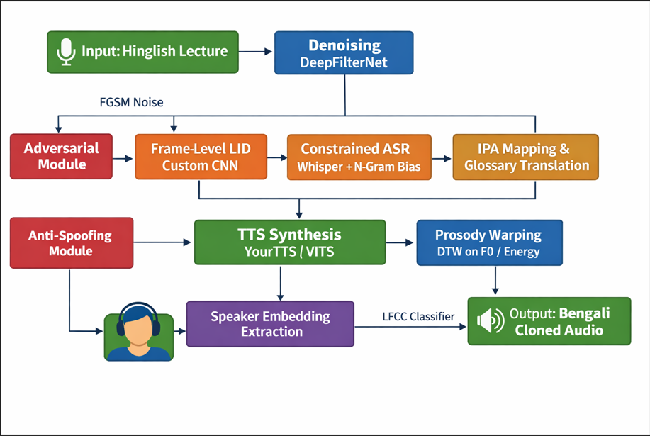

------------------------------------------------------------------------------
RollNo_PA2/
├── pipeline.py            # Main orchestrator
├── config.py              # Hyperparameters & Paths
├── lid_model.py           # Custom Frame-Level LID CNN
├── asr_engine.py          # Whisper with Custom Logit Biasing
├── translation_module.py  # IPA Mapping & Dictionary Lookup
├── tts_engine.py          # TTS with DTW Prosody Warping
├── security_module.py     # Anti-Spoofing (LFCC) & FGSM Attack
├── data_prep.py           # Denoising & Voice Recording
├── requirements.txt
├── README.md
└── data/                  # Audio Manifests
    ├── original_segment.wav
    ├── student_voice_ref.wav
    └── output_LRL_cloned.wav